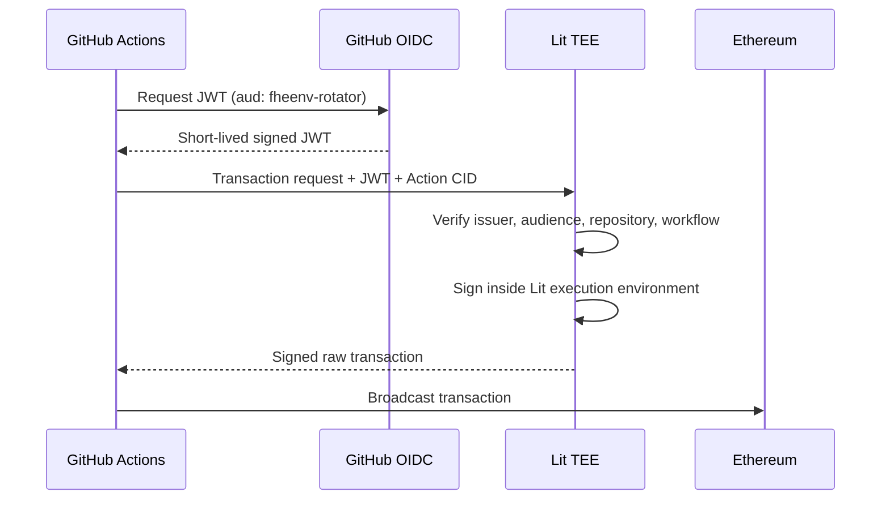

import { Callout } from "fumadocs-ui/components/callout";

# CI/CD Integration

Use a dedicated CI wallet with a time-limited grant. Never reuse a developer wallet or grant a
pipeline permanent access when an expiry window will work.

```bash
fheenv team add --member 0xCI_WALLET --env production --expires 8h
```

The grant expires on-chain. Any caller can invoke `expireAccess()` after the deadline to clean up
the expired grant.

## Signing options

### Platform secret

For ordinary secret consumption, store a dedicated wallet key in the CI platform's encrypted secret
store and expose it only to the job that needs it:

```yaml title=".github/workflows/deploy.yml"
name: Deploy
on:
  push:
    branches: [main]

jobs:
  deploy:
    runs-on: ubuntu-latest
    steps:
      - uses: actions/checkout@v4
      - name: Install fheENV
        run: curl -fsSL https://raw.githubusercontent.com/Team-Managed/fheENV/main/install.sh | bash
      - name: Start application
        env:
          FHEENV_PRIVATE_KEY: ${{ secrets.FHEENV_PRIVATE_KEY }}
        run: fheenv run --env production -- npm start
```

<Callout type="warn">
  `FHEENV_PRIVATE_KEY` is still a raw signing key. Scope the repository secret to the smallest
  environment and job possible, and use an expiring on-chain grant.
</Callout>

### Lit + GitHub OIDC Rotator

Scheduled rotation can use a Lit Action-backed Rotator account instead of placing a Rotator private
key in GitHub secrets. The workflow supplies a short-lived GitHub OIDC token and receives only a
signed raw transaction from Lit. The Rotator private key remains inside the Lit execution
environment and never enters the runner.



The workflow contains three Lit values:

| Value                   | Purpose                                                 | Signing secret? |
| ----------------------- | ------------------------------------------------------- | --------------- |
| `FHEENV_LIT_ACTION_CID` | Content address of the policy code and signing identity | No              |
| `FHEENV_LIT_API_KEY`    | Lit API usage credential                                | No              |
| `GITHUB_OIDC_JWT`       | Short-lived proof of the GitHub workload identity       | No              |

The Lit Action verifies GitHub's signature through its JWKS endpoint and checks the token issuer,
the `fheenv-rotator` audience, repository, and workflow path. A copied API key is therefore not
enough to request a signature. Changing the action policy changes its CID and derived signing
address; that new address does not automatically have the on-chain Rotator role.

```yaml title=".github/workflows/rotate.yml"
name: Rotate secrets
on:
  schedule:
    - cron: "0 3 * * *"

permissions:
  id-token: write
  contents: read

jobs:
  rotate:
    runs-on: ubuntu-latest
    steps:
      - uses: actions/checkout@v4
      - name: Run scheduled rotation
        env:
          FHEENV_LIT_ACTION_CID: ${{ vars.FHEENV_LIT_ACTION_CID }}
          FHEENV_LIT_API_KEY: ${{ secrets.FHEENV_LIT_API_KEY }}
          GITHUB_OIDC_JWT: ${{ steps.oidc.outputs.token }}
        run: fheenv rotate-check
```

The Rotator role is intentionally narrower than project ownership: it can update environments and
re-grant active members, but it does not become a project owner.

<Callout type="warn" title="Transaction policy hardening">
  The current SOC 2 branch action authenticates the workflow but accepts the transaction target,
  calldata, and chain ID supplied by that workflow. Before production use, pin the protected Git ref
  or environment and allowlist the Sepolia chain ID, registry address, zero ETH value, and rotation
  function selectors. OIDC prevents private-key extraction; these checks prevent an authorized but
  compromised workflow from requesting an unintended signature.
</Callout>

## Rotation policy

`fheenv rotate-check` reads each environment's policy from `.fheenv.json` and starts rotation before
the hard deadline so failed attempts have time to retry.

```json title=".fheenv.json"
{
  "rotationPolicy": {
    "production": { "expireInDays": 90, "graceMinutes": 15 }
  }
}
```

After a successful rotation, removal of the superseded Pinata pin is best-effort. Failures are
recorded for follow-up; unpinning does not guarantee that every IPFS node has discarded a copy.

## SOC 2 control mapping

| Control   | Mechanism                                                                                        |
| --------- | ------------------------------------------------------------------------------------------------ |
| **CC6.1** | Developer keyfiles can use scrypt-derived AES-256-GCM encryption; automation can use Lit + OIDC. |
| **CC6.3** | `--expires` provides time-limited CI access and reduces standing privilege.                      |
| **CC6.6** | `team remove` rotates by default; expired grants can be cleaned up permissionlessly.             |
| **CC7.2** | CLI activity is appended to local JSONL; chain events can be indexed and exported as CSV.        |
| **CC8.1** | Rotation policies and transaction-backed changes provide reviewable change evidence.             |

## Audit evidence

```bash
fheenv index-audit
fheenv export-audit --output audit-export.csv
```

The complete CLI audit file is local at `~/.fheenv/audit.log` with mode `0600`. It includes secret
accesses, membership changes, and rotations. Ship it to your SIEM if centralized retention is
required. The web dashboard shows public on-chain evidence only; it cannot read this local file.

<Callout type="info">
  These mechanisms support SOC 2 controls, but enabling a feature does not by itself make an
  organization SOC 2 compliant. Policies, review, retention, monitoring, and auditor evidence are
  still required.
</Callout>
